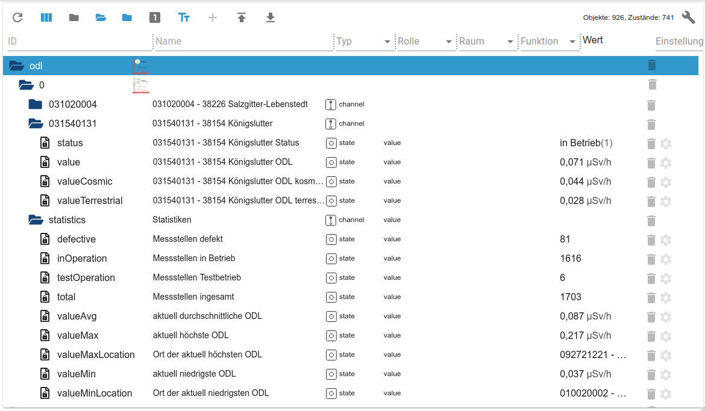

# ioBroker.odl

## Die aktuelle Umweltradioaktivität in ioBroker

Dieser Adapter integriert die ODL (Ortsdosisleistung) Messwerte von ausgewählten Messstellen des [Bundesamtes für Strahlenschutz (BfS)](https://www.bfs.de/) in ioBroker.

Das ODL-Messnetz des BfS überwacht mit rund 1.700 Messsonden rund um die Uhr die Strahlenbelastung durch natürliche Radioaktivität in der Umwelt. Das Messnetz hat eine wichtige Frühwarnfunktion, um erhöhte Strahlung durch radioaktive Stoffe in der Luft in Deutschland schnell zu erkennen.  
Die gewonnenen Messdaten werden vom BfS gesammelt, ausgewertet und öffentlich unter der _Datenlizenz Deutschland_ zur Verfügung gestellt.

Für weitere Informationen zur ODL siehe <https://odlinfo.bfs.de/>.

Dieser Adapter läd die aktuellen 1-Stunden-Mittelwerte der Messdaten direkt über die [offizielle Datenschnittstelle des BfS](https://odlinfo.bfs.de/ODL/DE/service/datenschnittstelle/datenschnittstelle_node.html). Das BfS ist Urheber der vom Adapter verwendeten Daten.  
Alle Daten werden in unveränderter Form, so wie sie von der Datenschnittstelle geliefert werden, vom Adapter bereitgestellt.

Wird ein aktivierter History-Adapter (_history_, _influxdb_ oder _sql_) für einen Werte-State erkannt, dann werden gegebenenfalls in der Historie fehlende Datenpunkte durch den Adapter automatisch nachgetragen, sodass sich vollständige Zeitreihen ergeben.

Die aktuellen Messdaten werden von dem Adapter standardmäßig im Stundentakt aktualisiert. Ein geringerer Aktualisierungsintervall ist meist nicht sinnvoll, da die zu Grunde liegenden Messdaten auf dem BfS-Server (abhängig von der Messstelle) größtenteils stündlich aktualisiert werden.  
Beim ersten Start des Adapters wird automatisch der Zeitpunkt für den Abruf der Daten angepasst, sodass nicht alle Installation die Daten zur gleichen Zeit abrufen und die Datenschnittstelle des BfS nicht unnötig belastet wird.

## Kennungen der Messstellen finden

Um die für den Adapter benötigten Kennungen der Messstellen zu finden, ruft man die [Liste der Messstellen auf ODL-Info](https://odlinfo.bfs.de/ODL/DE/themen/wo-stehen-die-sonden/liste/liste_node.html) auf und sucht dort nach der Messstelle.

Wenn man nun die gewünschte Messstelle öffnet, dann steht die Kennung als `?id=...` in der URL im Browser.

Beispiel für die Messstelle _Berlin-Karlshorst_:

* URL: `https://odlinfo.bfs.de/ODL/DE/themen/wo-stehen-die-sonden/karte/_documents/Messstelle.html?id=110000006`
* Kennung (ID): `110000006`
