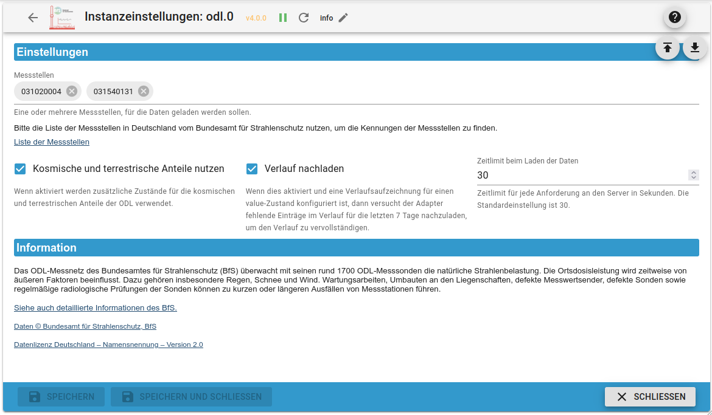
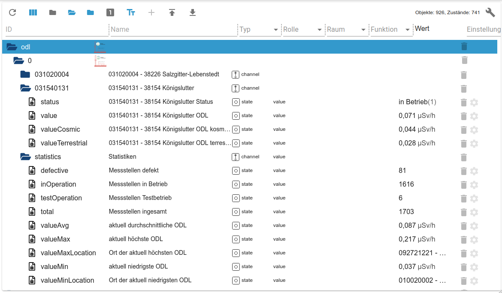

# ioBroker.odl

## The current environmental radioactivity in ioBroker

This adapter integrates the ODL (Ortsdosisleistung / Ambient Dose Rate) values of specified measuring points of the German [Federal Office for Radiation Protection (Bundesamt für Strahlenschutz, BfS)](https://www.bfs.de/) into ioBroker.

The ODL measuring network of the Federal Office for Radiation Protection uses around 1,700 measuring probes to monitor radiation levels from natural radioactivity in the environment around the clock. The measuring network has an important early warning function in order to quickly detect increased radiation from radioactive substances in the air in Germany.  
The measurement data obtained are collected and evaluated by the BfS and made publicly available under the _Data License Germany_.

For more details regarding the Ambient Dose Rate see <https://odlinfo.bfs.de/>.

This adapter downloads the current 1 hour mean values of the measurement data using the [official data interface provided by the BfS](https://odlinfo.bfs.de/ODL/EN/service/data-interface/data-interface_node.html). The BfS

Dieser Adapter läd die aktuellen 1-Stunden-Mittelwerte der Messdaten direkt über die [offizielle Datenschnittstelle des BfS](https://odlinfo.bfs.de/ODL/DE/service/datenschnittstelle/datenschnittstelle_node.html). The BfS is the originator of the data used by the adapter.  
All data is provided by the adapter in an unchanged form as delivered by the data interface.

If an enabled history adapter (_history_, _influxdb_ or _sql_) is detected for some value state, the adapter tries to fill missing values in the history by downloading missing values to create a complete history.

By default, the adapter updates the current measurement data every hour. A shorter update interval is usually not useful, since the underlying measurement data on the BfS server (depending on the measuring point) are mostly updated hourly.  
When the adapter is started for the first time, the time for retrieving the data is automatically adjusted so that not all installations retrieve the data at the same time and the BfS data interface is not unnecessarily loaded.

## Find the ID of measuring stations

To find the ID required by the adapter, you need to open the [List of measuring stations on ODL-Info](https://odlinfo.bfs.de/ODL/EN/topics/location-of-measuring-stations/list/list_node.html) and search for the measuring station.

If you open the desired measuring station, you can find the ID in URL of the browser as `?id=...`.

Example for the measuring point _Berlin-Karlshorst_:

* URL: `https://odlinfo.bfs.de/ODL/EN/topics/location-of-measuring-stations/map/_documents/Messstelle.html?id=110000006`
* ID: `110000006`
